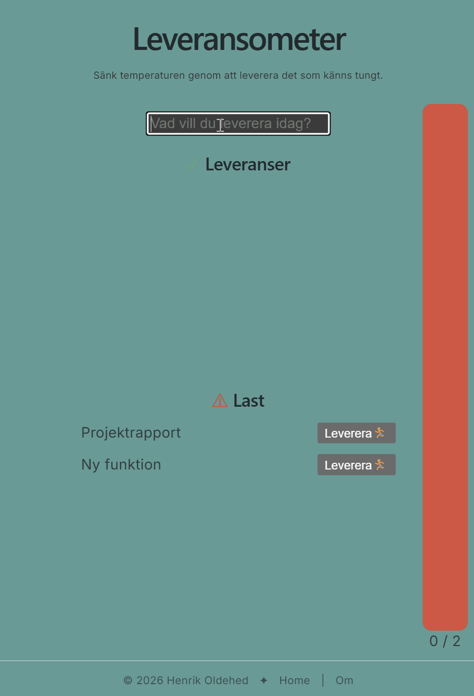
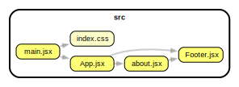

## 🚀 Leveransometer
*Det viktiga är inte hur mycket du bär, utan vad du faktiskt levererar.*

**Leveransometer** är en produktivitetsapp som hjälper dig att fokusera på framsteg. Istället för att bara checka av uppgifter visualiserar appen balansen mellan din last (det du bär på) och dina leveranser (det du faktiskt genomför). Resultatet är ett tydligare, mer motiverande sätt att se din produktivitet.

Appen är utvecklad med fokus på enkelhet, tydlig informationsdesign och ett nytt sätt att tänka kring produktivitet.

## 💡 Varför Leveransometer?
Traditionella att‑göra‑listor fokuserar på mängden uppgifter. Leveransometer fokuserar på värdet du skapar.

- Flytta fokus från belastning → till leverans

- Se dina framsteg visualiserade i realtid

- Få en mer motiverande och balanserad bild av din produktivitet

- Arbeta med ett minimalistiskt, tydligt gränssnitt

## 📸 Förhandsvisning

<p align="center">
  
</p>


## 🧩 Core Concepts (Domänmodell)

**Last**
Uppgifter du bär på — det som ligger i din pipeline.

**Leveranser** 
Uppgifter du slutför — det som faktiskt skapar värde.

**Balansvisualisering** 
En grafisk representation av relationen mellan last och leveranser. Det är appens kärna.

## ✨ Funktioner

* Skapa och hantera **uppgifter**
* Markera genomförda **leveranser**
* Visualisering av balans mellan **last och leverans**
* Omedelbar överblick av framsteg
* Responsiv design
* Modern komponentbaserad React‑arkitektur
* Enkel navigering med React Router

## 🛠️ Teknikstack
* **Frontend:** React 19
* **Byggverktyg:** Vite
* **Routing:** React Router DOM v7
* **Styling:** CSS3 (variabler, nesting, keyframes)
* **Kodkvalitet:** ESLint v10
* **Deployment:** GitHub Pages

## 📁 Projektstruktur & arkitektur

Applikationen är uppbyggd med en modulär komponentstruktur där varje del har ett tydligt ansvar.

Exempel på beroendeflöde:

```text
main.jsx
   │
   ▼
App.jsx
   │
   ├── About.jsx
   │
   └── Footer.jsx
```

Ett mer detaljerat arkitekturdiagram finns här:


<p align="center">
  
</p>

Diagrammet är genererat med Graphviz och visar relationen mellan projektets komponenter.

## 🧰 Förutsättningar

- **Node.js**
- **npm**

## 🚀 Kom igång lokalt

**Klona repot:**

```bash
git clone https://github.com/nat15hol/leverans.git
cd leverans
```

**Installera beroenden:**

```bash
npm install
```

**Starta utvecklingsservern:**

```bash
npm run dev
```

Applikationen körs sedan lokalt via adressen som visas i terminalen.

## 🌐 Driftsättning

Projektet är konfigurerat för publicering via GitHub Pages.

```bash
npm run deploy
```

Live-version:
https://nat15hol.github.io/leverans/

## 🗄️ Datalagring

Ingen backend eller extern databas används. Uppgifter hanteras i klientens minne (React state) och försvinner när sidan laddas om.

## 🐞 Rapportera problem 

Har du hittat en bugg eller har ett förbättringsförslag? Skapa gärna ett GitHub Issue.

## 👨‍💻 Utvecklare

**Henrik Oldehed** 

Utvecklad med fokus på enkelhet, tydlig informationsdesign och ett nytt sätt att tänka kring produktivitet.

🐙 [GitHub](https://github.com/nat15hol)  
💼 [LinkedIn](https://www.linkedin.com/in/henrikoldehed/)